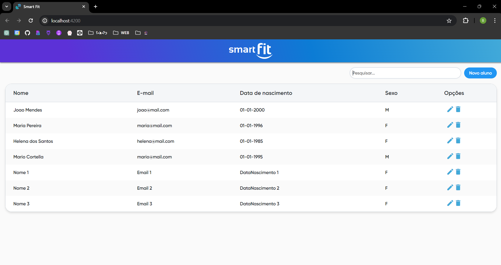
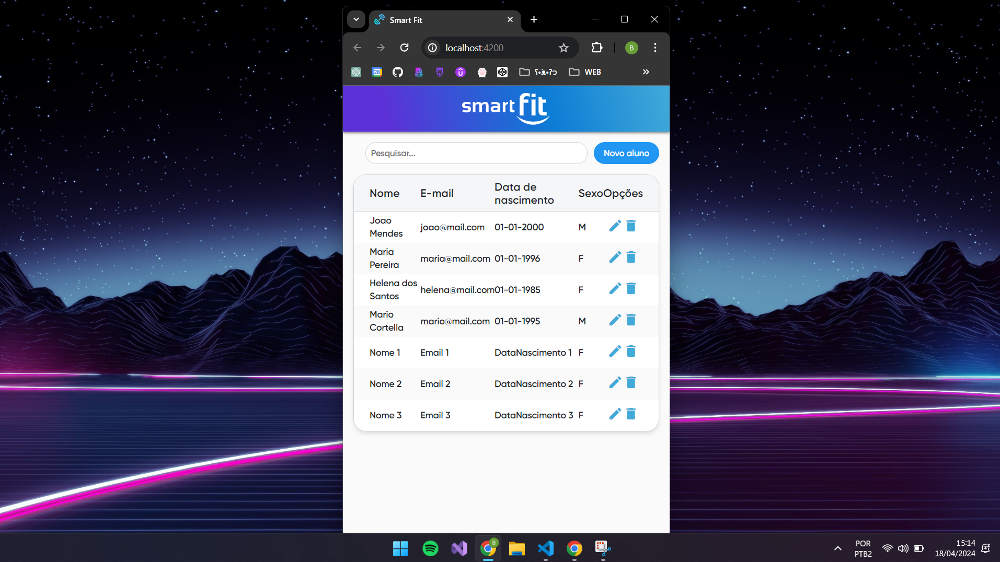
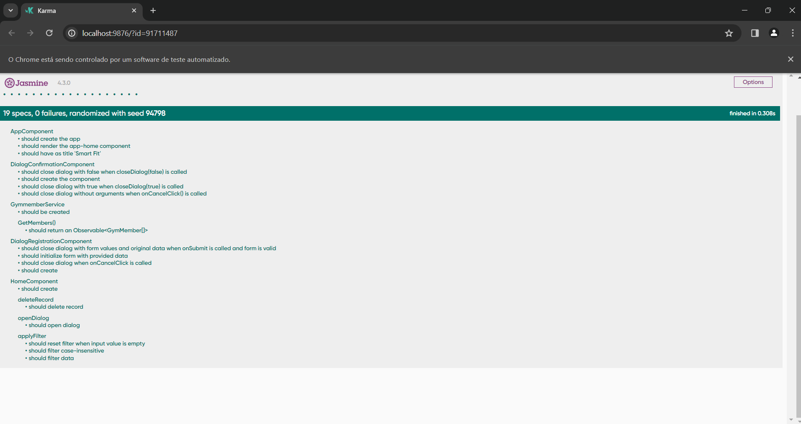

# CRUD Angular 14
Este projeto consiste em uma aplicação Angular que permite realizar operações CRUD em uma lista de alunos de uma academia, consumindo uma API REST e armazenando os dados localmente.

## Pré requisitos  ⚠️
Antes de começar, é necessário ter instalado em sua máquina as seguintes ferramentas:

- [Git](https://git-scm.com)
- [Node.js](https://nodejs.org/en/)
- [Angular](https://cli.angular.io/)

## Instalação 🔧

Para executar esse projeto localmente, siga esses passos:

1. Para clonar o repositório, você pode executar o seguinte comando:
   
    ```
    git clone https://github.com/brunaa-f/smartFit
    ```
2. Navegue até o diretório:
   
   ```bash
    cd smartFit
    ```
3. Instação das dependências usando o npm:

    ```bash
    npm install
    ```
## Execução ▶

Execute o seguinte comando `ng serve`. Acesse `http://localhost:4200/` em seu navegador. A aplicação será recarregada automaticamente caso você faça alguma alteração nos arquivos de origem.

## Preview





## Executando testes unitários  📝

Para executar os testes unitários, utilize o comando `ng test`. Isso acionará os testes via [Karma](https://karma-runner.github.io).

